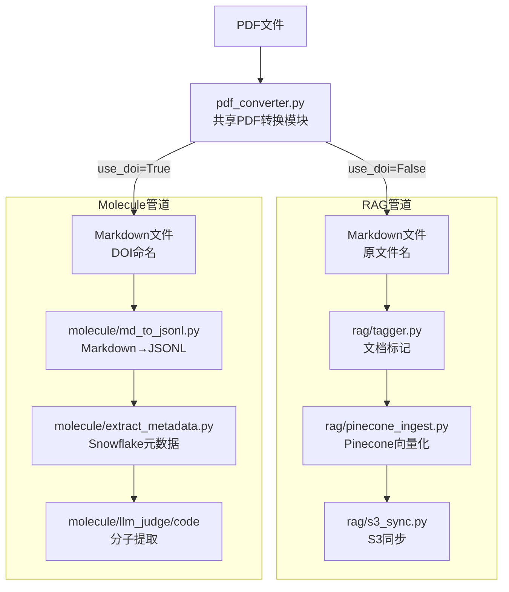

# 统一分子提取与RAG管道重构

## 背景分析

两个脚本存在以下**重复 PDF 转换代码**：

| 函数 | `process_pdf_assb.py` | `run_pipeline.py` |

|---|---|---|

| `pdf_files_paths()` | 完全相同 | 完全相同 |

| `sanitize_filename()` | 完全相同 | 完全相同 |

| `parallel_process_files()` | 完全相同 | 完全相同 |

| `process_pdf_and_save()` | DOI重命名，无artifact清理 | 原文件名，有artifact目录清理 |

额外问题：`process_pdf_assb.py` 的 `extract_pdf_to_md_with_doi()` 为提取DOI**将同一PDF转换两次**（第一次用CPU提取DOI，第二次用CUDA生成实际输出）。

## 目标目录结构

```
unified_pipeline/
├── run_pipeline.py              ← 统一入口（argparse，支持 --pipeline rag|molecule|all）
├── pdf_converter.py             ← 共享PDF转换模块（去重后唯一实现）
├── rag/
│   ├── __init__.py
│   ├── tagger.py                ← 步骤1：文档标记（OpenAI）
│   ├── pinecone_ingest.py       ← 步骤2：Pinecone向量化
│   └── s3_sync.py               ← 步骤3：S3同步
├── molecule/
│   ├── __init__.py
│   ├── md_to_jsonl.py           ← 步骤1：Markdown→JSONL（来自json_processer_helper.py）
│   ├── extract_metadata.py      ← 步骤2：Snowflake元数据更新（来自extract_metadata.py）
│   └── llm_judge/
│       └── code/                ← 步骤3：分子提取（来自现有代码，保持不变）
│           ├── build_graph_paper_patent.py
│           └── add_molecules_to_database.py
├── config.json                  ← AWS/Snowflake配置
└── requirements.txt
```

## 各文件核心设计

### `pdf_converter.py`（去重核心）

保留 `run_pipeline.py` 中更完整的实现（含artifact目录清理），新增 `use_doi` 参数支持DOI命名模式，**修复双重PDF转换**问题：

```python
# 不再单独调用extract_pdf_to_md_with_doi()转换两次
# 而是先CUDA转换生成md文本，再从md文本中调用GPT提取DOI
def process_pdf_and_save(pdf_file_path, root_output_dir, use_doi=False):
    ...
    conv_res = doc_converter.convert(input_doc_path)  # 只转换一次
    md_text = conv_res.document.export_to_markdown(...)
    if use_doi:
        doi = call_gpt_extract(md_text).get("DOI")  # 从已生成的md中提取DOI
        doc_file_name = sanitize_filename(doi)
    ...
```

### `rag/tagger.py`

从 `run_pipeline.py` 的 `step1_tag_documents()` 及其辅助函数提取：`assign_tags_via_openai`, `process_documents`, `generate_triples`, `collect_md_paths`

### `rag/pinecone_ingest.py`

从 `run_pipeline.py` 的 `step2_ingest_to_pinecone()` 及其辅助函数提取：`get_dense_embeddings`, `get_sparse_embeddings`, `load_tags_map`

### `rag/s3_sync.py`

从 `run_pipeline.py` 的 `step3_sync_to_s3()` 及其辅助函数提取

### `molecule/extract_metadata.py`

从现有 `extract_metadata.py` 复制，移除模块顶层的硬编码初始化（`config_data = json.load(open(...))` 应移入函数内部），改为从 `config.json` 动态加载

### `run_pipeline.py`（统一入口）

```
--pipeline rag|molecule|all    选择执行哪条管道（默认: all）
--pdf-input                    PDF来源目录
--pdf-output                   Markdown输出目录
--steps 0 1 2 3                可选步骤过滤
# RAG专用参数
--index, --namespace, --start-id, --bucket, --prefix
# Molecule专用参数
--jsonl-dir, --temp-meta-path
```

## 管道流程图



## `requirements.txt` 主要依赖

- `docling`, `docling-core` — PDF转Markdown
- `openai` — 文档标记 & DOI/元数据提取
- `pinecone` — 向量数据库
- `langchain-text-splitters` — 文本分块
- `boto3` — AWS S3
- `snowflake-connector-python` — Snowflake
- `pandas`, `openpyxl` — 数据处理
- `tenacity` — 重试
- `tqdm`, `python-dotenv`, `python-dateutil`, `requests`